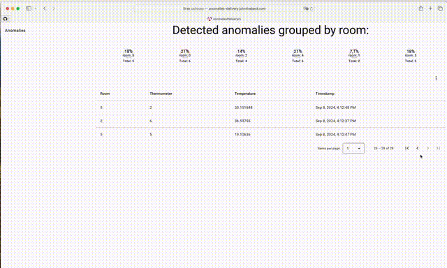
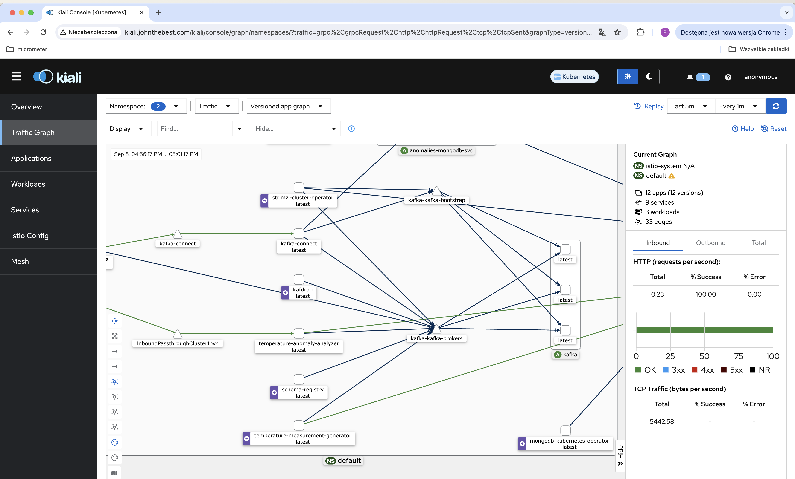
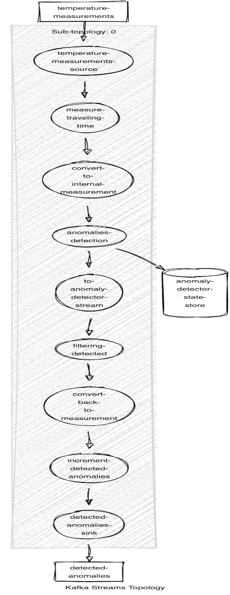

# Always right temp

## System description
System for detecting temperature anomalies based on temperature threshold and amount of last recent measurements.  

### Functionalities:
- Generating example temperature measurements
- Collect and analyze measurements in order to detect anomalies
- Transfer detected anomalies to database
- present for users detected anomalies in real time in browser

## anomalies delivery ui

## Kiali architecture view

## Topology definition for temperature anomaly analyzer

## Installation

Running application is quite simple - it needs to have some tools already installed (k3d, helm, istioctl, kubectl).
Before run script "cluster.sh", please remember to add entries in /etc/hosts defines domains, which will be used to get access to applications / tools (VirtualService's defines required domain names).
Also it is required to build applications images. Finally, after install / build all required things, you can run k8s cluster using "cluster.sh" script.
